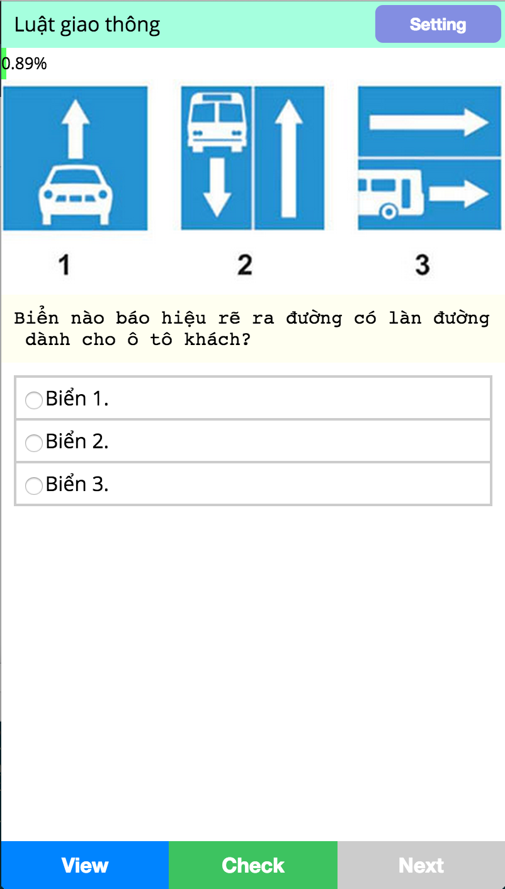
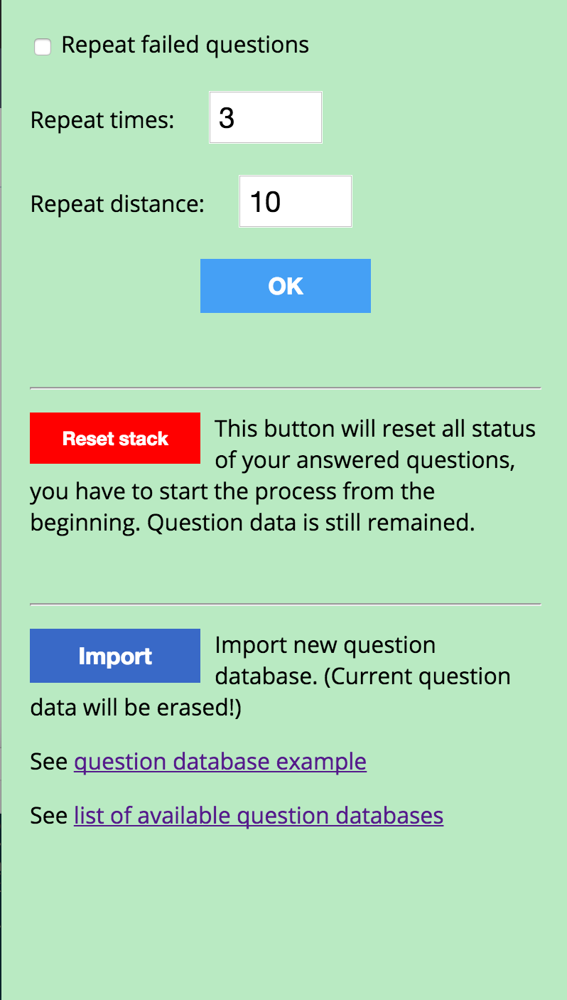

# School revision tool
A tool I wrote to do self-review before school exam.

# What it looks like

http://trungdq88.github.io/school-revision-tool/




# What it does?

- Display the questions and answers
- Check your answer
- If you answer it wrong, the question will repeat (somewhere later) until you get it right!

# Development

This tool is written long time ago, back then I was beginner at web development and I totally have no idea about frameworks, or build tools. So it just the `index.html`, open it and edit in your will.

# How to add your own question bank

### 1. Prepare a JSON data follow this format

```
{
  "name": "Question bank name",
  "author": "Who made this bank",
  "questions": [
    {
      "question": "What does the fox say?",
      "a": "Pa pa pa pa pau!",
      "b": "Hachi hachi hachihou!",
      "c": "Aouuuuuuu uuuu!",
      "d": "",
      "e": "",
      "f": "",
      "answer": "ab",
      "image": "",
      "tip": "The fox says what it says!"
    },
    // More questions...
  ]
}
```

Example question bank: https://github.com/trungdq88/school-revision-tool/blob/master/data/luat-giao-thong.json

### 2. Upload it to somewhere and get the URL

### 3. Open app > Setting > Import > Enter your URL.
